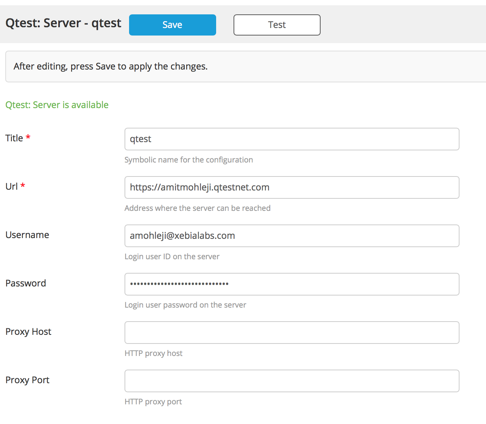

# xlr-qtest-plugin

This plugin offers an interface from XL Release to QA Symphony qtest API. 

# CI status #

[![Build Status][xlr-qtest-plugin-travis-image]][xlr-qtest-plugin-travis-url]
[![Codacy Badge][xlr-qtest-plugin-codacy-image] ][xlr-qtest-plugin-codacy-url]
[![Code Climate][xlr-qtest-plugin-code-climate-image] ][xlr-qtest-plugin-code-climate-url]

[xlr-qtest-plugin-travis-image]: https://travis-ci.org/xebialabs-community/xlr-qtest-plugin.svg?branch=master
[xlr-qtest-plugin-travis-url]: https://travis-ci.org/xebialabs-community/xlr-qtest-plugin
[xlr-qtest-plugin-codacy-image]: https://api.codacy.com/project/badge/Grade/0e664aaacd2f4010b091f0ef4ce1c7d0
[xlr-qtest-plugin-codacy-url]: https://www.codacy.com/app/amitmohleji/xlr-qtest-plugin
[xlr-qtest-plugin-code-climate-image]: https://codeclimate.com/github/xebialabs-community/xlr-qtest-plugin/badges/gpa.svg
[xlr-qtest-plugin-code-climate-url]: https://codeclimate.com/github/xebialabs-community/xlr-qtest-plugin

# Development #

* Start XLR: `./gradlew runDockerCompose`

# Type definitions #
+ `qtest.Server`: Defines your qtest server endpoint to be used.
+ `qtest.Login`: This task uses the provided credentials to login first time and get an OAuth token which is recieved as an output variable of type password. It can then be passed to other tasks for avoiding re-authentication
+ `qtest.AddComment`: This task allows you to search for objects of any type under a project and then put a comment on those objects. You can use the data Query from qtest web interface
+ `qtest.CreateTestCase` : This task allows you to add a new test case under a project. You can specify field properties by identifying the field Ids in your installation. You can also provide test steps with description and expected criteria
    
# Usage #
   
* Setup the server configuration

* Setup a Login Task in Template. Login will generate and Oauth token that will be passed as output and can be stored in a variable and used in other tasks for further authorization.

* Setup a Add Comment Task in Template

* Setup a Add Test Case Task in Template

# References #
[QA Symphony's qtest API](https://support.qasymphony.com/hc/en-us/articles/201615649-qTest-API-v3-Specification)

